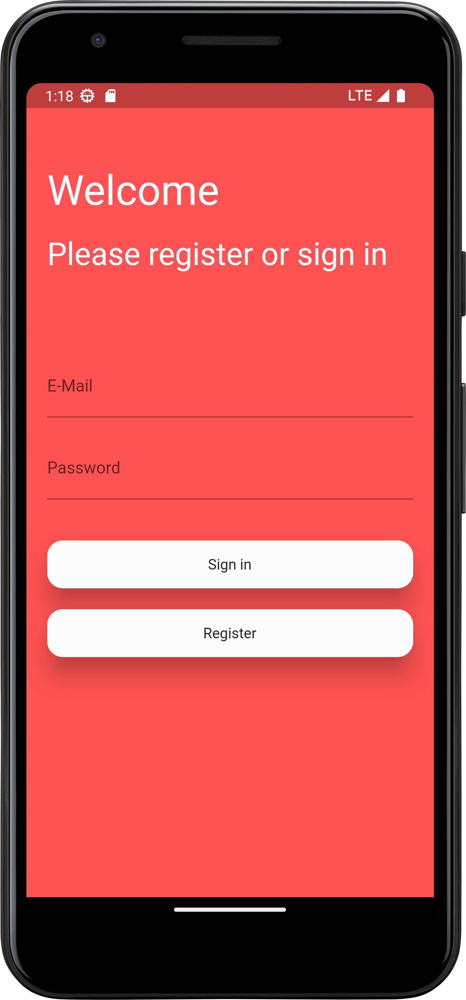
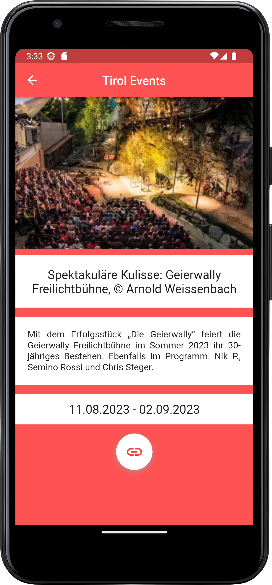
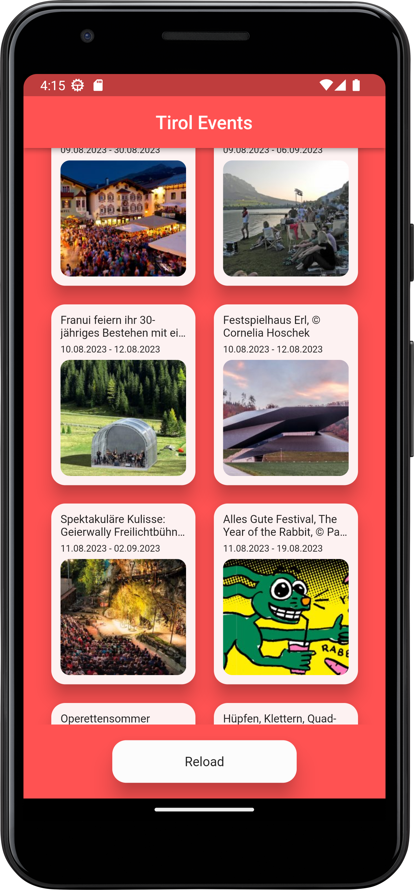

# Tirolevents App

Events of Tirol with signin form using Firebase.

## Images

## Info

### BlocBuilder

This is used when we want to draw a Widget based on what is the current State.

### BlocListener

This is just a listener not a builder (like the above), that means that its job is keep listening for new changes in the state and **not to return a widget**. Each time the state changes to a new state this listener will receive a notification that the state has changed and then you can trigger an action (e.g. Send a notification, consume an endpoint, analytics, etc).

### BlocConsumer

This is a mix between “BlocListener” and “BlocBuilder”. This is used when we want to draw something based on the current state and execute some actions depending on the new arriving states.

### BlocProvider

BlocProvider is a Flutter widget which provides a bloc to its children via BlocProvider.of<T>(context). It is used as a dependency injection (DI) widget so that a single instance of a bloc can be provided to multiple widgets within a subtree.

In most cases, BlocProvider should be used to create new blocs which will be made available to the rest of the subtree. In this case, since BlocProvider is responsible for creating the bloc, it will automatically handle closing it.